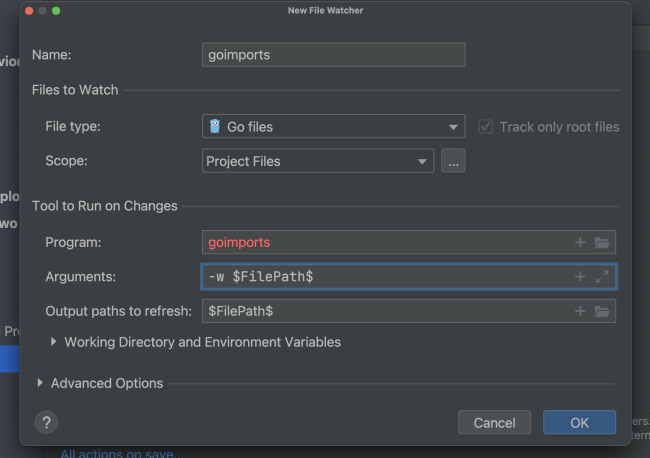

### Go 的安装使用中的一些问题记录

1. 执行 ``` go env -w GOPROXY ``` 将配置写到了 go env GOENV 文件里，所以go删除后重装，配置还在。  
<br>

2. 在配置goimports 时提示没有，详情如下图：

* 解决办法可参考[click here](http://studygolang.com/articles/30933)


<br/>

[上一页](./README.md)